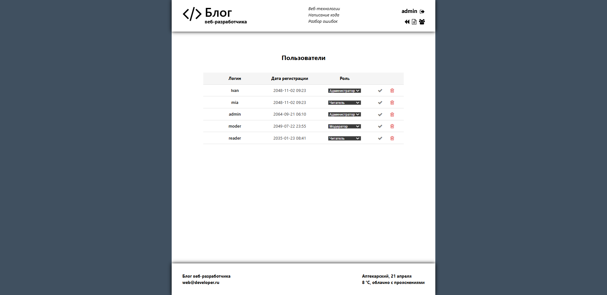
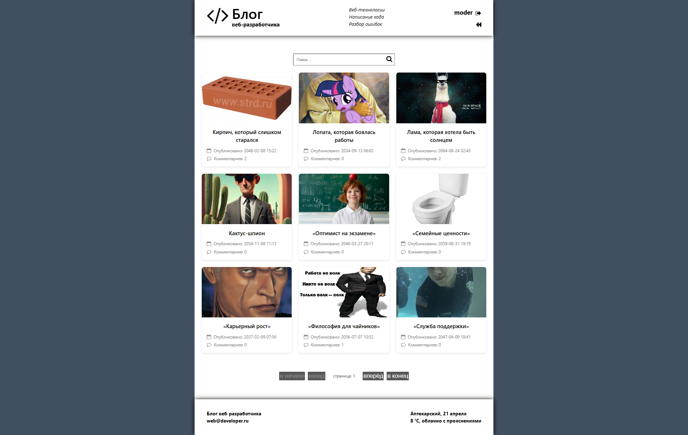
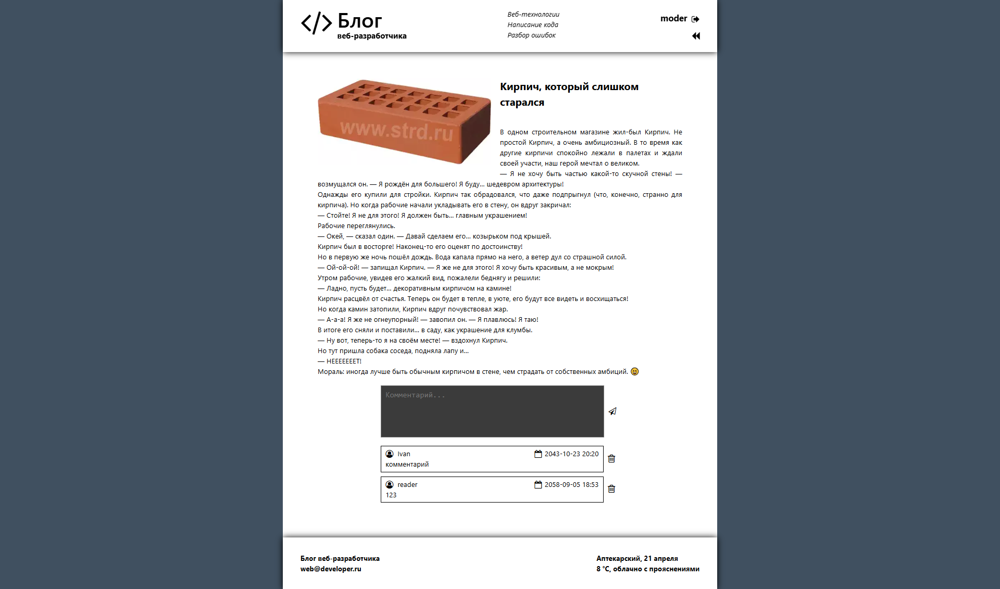

# Author Blog

**Простой блог-приложение с использованием json-server, BFF-слоя и React/Redux фронтенда.**

---

## Содержание

- [Введение](#введение)
- [Функционал](#функционал)
- [Архитектура](#архитектура)
- [Технологический стек](#технологический-стек)
- [Начало работы](#начало-работы)
  - [Требования](#требования)
  - [Установка](#установка)
  - [Запуск приложения](#запуск-приложения)
- [Структура проекта](#структура-проекта)
- [Схема БД и API](#схема-бд-и-api)
- [Схема Redux Store](#схема-redux-store)
- [Вставка видео работы приложения](#вставка-видео-работы-приложения)
- [Участие в разработке](#участие-в-разработке)
- [Контакты](#контакты)

---

## Введение

**Author Blog** — демонстрационное приложение, которое показывает полный стек: mock-база на `json-server`, BFF-слой для аутентификации и управления сессией, и фронтенд на React с Redux для управления состоянием. Пользователи могут регистрироваться, входить в систему, читать статьи, добавлять комментарии и работать с ролями.

## Функционал

- Регистрация и авторизация пользователей
- Управление сессией и ролями (админ и обычный пользователь)
- CRUD-операции для статей (posts)
- Комментирование статей
- Обновление клиентского состояния в реальном времени через Redux
- Mock REST API на базе `json-server`

## Архитектура

```text
┌──────────────────────┐      ┌─────────────┐      ┌──────────────┐
│  JSON Server (БД)    │◀────▶│  BFF Layer  │◀────▶│  React App   │
│ - Users, Roles,      │      │ - Auth      │      │ - Redux      │
│   Posts, Comments    │      │ - Session   │      │ - UI         │
└──────────────────────┘      └─────────────┘      └──────────────┘
```

- **БД**: `json-server`, файл `db.json`.
- **BFF**: Node.js + Express (TypeScript), реализует логику аутентификации и проверки ролей.
- **Фронтенд**: React, Redux Toolkit, TypeScript, Vite.

## Технологический стек

- **Бэкенд**: `json-server` (mock API)
- **BFF**: TypeScript
- **Фронтенд**: React, Redux, Redux Toolkit, TypeScript, Vite, Axios
- **Стилизация**: CSS Modules

## Начало работы

### Требования

- Node.js v14+
- npm или Yarn

### Установка

1. Клонируйте репозиторий:

   ```bash
    git clone git@github.com:lanovich/Author_blog.git
   ```
   ```bash
    cd Author_blog
   ```
   ```bash
   npm install
   ```

1. **JSON Server**

   ```bash
   npx json-server --watch src/db.json --port 3333
   ```

   API доступно по адресу `http://localhost:3333`.

1. **Фронтенд**
   ```bash
   npm run dev
   ```
   Приложение доступно на `http://localhost:5173`.

## Структура проекта

```text
Author_blog/
├── db.json                # Mock БД (Users, Roles, Posts, Comments)
├── bff/                   # Код BFF-слоя
│   ├── api/               # Взаимодействие с json-server
│   ├── operations/        # Слой операций для обращения к api
│   └── transformers/      # Трансформеры
│
│
├── public/                # Статические файлы
├── src/                   # Исходники React-приложения
│   ├── components/        # UI-компоненты
│   ├── pages/             # Компоненты страниц
│   ├── hooks/             # Кастомные хуки
│   ├── store/             # Конфигурация Redux Store
│   └── App.tsx
├── package.json           # Скрипты монорепозитория
├── tsconfig.json
└── vite.config.ts
```

## Схема БД и API

### Таблицы

- **Users** `(id, login, password, registered_at, role_id)`
- **Roles** `(id, name)`
- **Posts** `(id, title, image_url, content, published_at)`
- **Comments** `(id, author_id, post_id, content, author, published_at)`

### Основные эндпоинты BFF

- `POST /users` – вход, возвращает данные пользователя и создаёт сессию
- `DELETE /sessions` – выход из системы, удаление сессии
- `GET /users` – список пользователей
- `GET /roles` – список ролей
- `GET /posts` – список статей с числом комментариев
- `GET /posts/:id` – детали статьи с комментариями
- `POST /posts` – создание статьи (только админ)
- `PATCH /posts/:id` – обновление статьи (только админ)
- `DELETE /posts/:id` – удаление статьи (только админ)
- `POST /comments` – добавление комментария

## Схема Redux Store

- **user**: `{ id, login, roleId, session }` – текущий пользователь
- **users**: `User[]` – массив пользователей с полями `{ id, session, login, roleId }`
- **posts**: `PostSummary[]` – массив статей `{ id, title, imageUrl, content, publishedAt, Comment[] }`
- **post**: `PostDetail` – полная статья `{ id, title, content, publishedAt, comments: Comment[] }`

## Скриншоты приложения







При просмотре README на GitHub изображения будут загружаться из папки `public` автоматически.

## Участие в разработке

1. Форкните репозиторий
2. Создайте ветку для фичи (`git checkout -b feature/имя`)
3. Внесите изменения и закоммитьте (`git commit -m "Описание изменений"`)
4. Запушьте ветку (`git push origin feature/имя`)
5. Откройте Pull Request

## Контакты

Поддерживает: [lanovich](https://github.com/lanovich). Для вопросов открывайте issue или пишите в GitHub.
